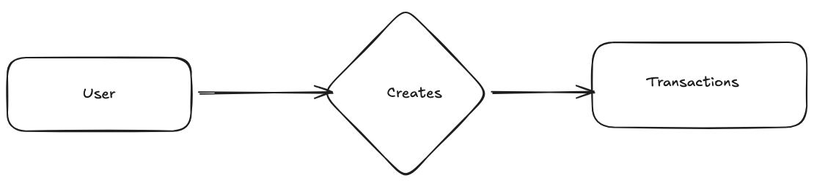

# Data model:

## 1. Entities:

- User
- Transactions

## 2. Relationships:

- Users create Transactions

## 3. ER Diagram

## 4. Attributes 

**transactions table:**

| Attribute | Type | Notes |
|-----------|-----------|-----------|
| idempotency_key | Char(36) representing a UUID | unique identifier for each transaction (primary key) |
| status | varchar(16) | transaction status such as pending, processed etc, Note: this isn't an ENUM here to keep things flexible |
| amount | DECIMAL(12,2) | Note: the currency is defaulted to USD, BIGINT is also a valid option representing the amount in cents |
|provider_txn_id   |VARCHAR(64)| represents the transaction identifier associated with the external payments API |
|  failure_code     | VARCHAR(32)|
|  failure_reason   |VARCHAR(255)|
| created_at | TIMESTAMP |
| updated_at | TIMESTAMP |