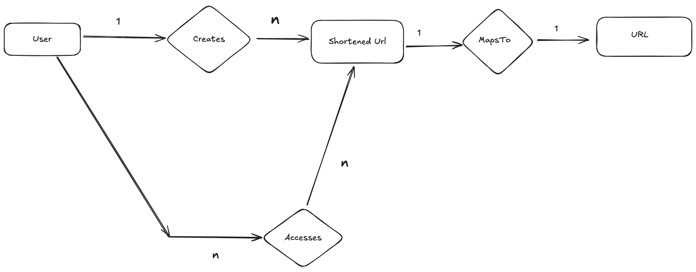

# Data model:

## 1. Entities:

- User
- Shortened URL
- URL

## 2. Relationships:

- Users create Shortened URLs that map to full URLs
- Users (even anonymous ones) access the shortened URL

## 3. ER Diagram

## 4. Attributes    

**users table:**

| Attribute | Type | Notes |
|-----------|-----------|-----------|
| userId | long | Auto incrementing counter (primary key) |
| username | varchar(32) | User defined username |
| password | varchar(32) | Encrypted password |
| emailId | varchar(32) | |

**urls table:**

| Attribute | Type | Notes |
|-----------|-----------|-----------|
| url | String | String that represents a standard URL |
| shortenedURL | varchar(10) |  |
| userId | long | foreign key |