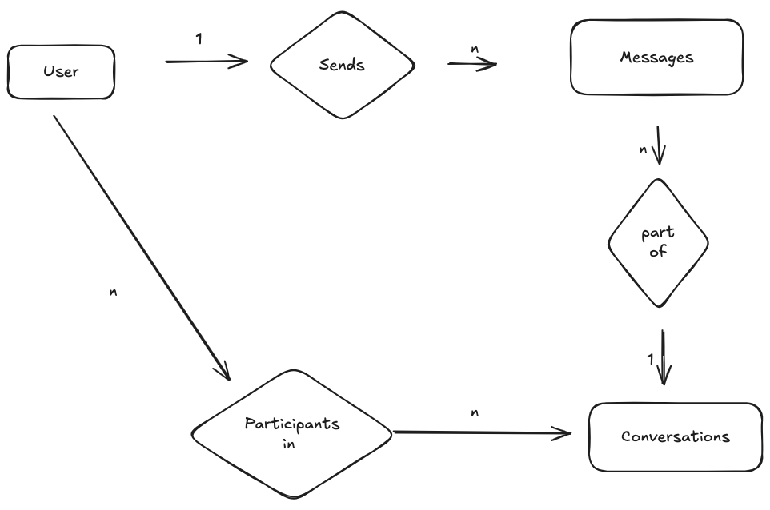

# Data model:

## 1. Entities:

- User: Represents whatsapp users
- Messages: Represents messages sent by users
- Conversations: Represents each conversation that a user is part of
- Conversation Participants: Represents the participants of conversations - example: muliple users can be part of
a single conversation incase it's a group

## 2. Relationships:

- User sends messages
- Messages are a part of conversations
- Users are participants in conversations

## 3. ER Diagram

## 4. Attributes    

### User table:

| Attribute                | Type          | Notes                                                    |
| ------------------------ | ------------- | -------------------------------------------------------- |
| user_id                 | UUID / BIGINT | Primary key, globally unique                             |
| phone_number            | VARCHAR(15)   | Indexed for login/search, supports international numbers |
| name | VARCHAR(30) | Optional, 30-character limit (arbitrary) |
| user_type | ENUM |'individual' or 'business'|
