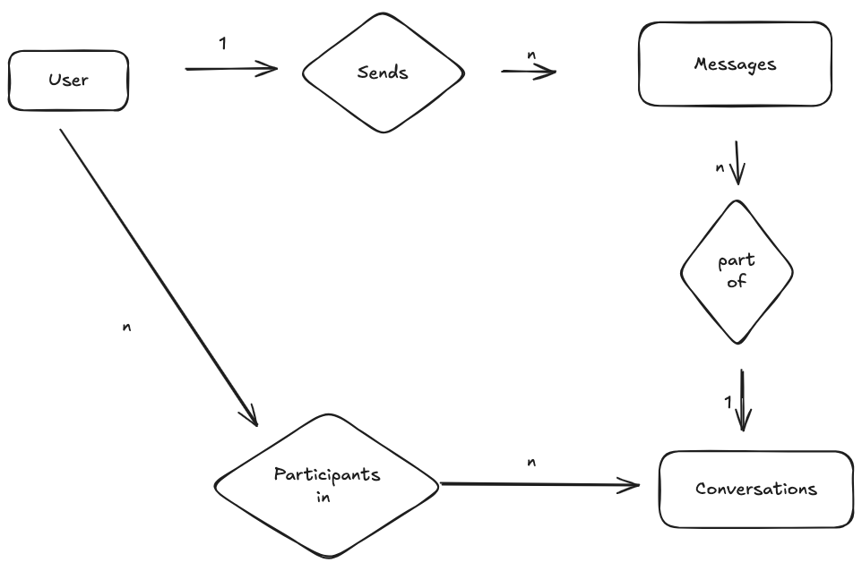

# Data model:

## 1. Entities:

- User: Represents whatsapp users
- Messages: Represents messages sent by users
- Conversations: Represents each conversation that a user is part of
- Conversation Participants: Represents the participants of conversations - example: multiple users can be part of
a single conversation incase it's a group

## 2. Relationships:

- User sends messages
- Messages are a part of conversations
- Users are participants in conversations

## 3. ER Diagram

## 4. Attributes    

### users table:

| Attribute                | Type          | Notes                                                    |
| ------------------------ | ------------- | -------------------------------------------------------- |
| user_id                 | BIGINT | Primary key, globally unique - snowflake style                          |
| phone_number            | VARCHAR(15)   | Indexed for login/search, supports international numbers |
| name | VARCHAR(30) | Optional, 30-character limit (arbitrary) |
| user_type | ENUM |'individual' or 'business'|

Note: we're going to have to come up with a way to create globally unique user_ids if there are multiple databases

here's an example for that -> snowflake ID -> https://en.wikipedia.org/wiki/Snowflake_ID

### messages table:

 Attribute                | Type          | Notes                                                    |
| ------------------------ | ------------- | -------------------------------------------------------- |
| message_id                 | BIGINT | Primary key, globally unique                             |
| conversation_id | BIGINT | foreign key -> conversations |
| user_id          | BIGINT | foreign key -> users (sender)|
| text | TEXT | message content - Up to 65,535 characters |
| timestamp | TIMESTAMP | Message creation time |
| status | ENUM |'sent', 'delivered', 'read' (optional) |

### conversations table:

 Attribute                | Type          | Notes                                                    |
| ------------------------ | ------------- | -------------------------------------------------------- |
| conversation_id          | UUID / BIGINT | Primary key, globally unique                             |
| conversation_type | ENUM  | could be group, individual_chat etc |

### conversation_participants table:

 Attribute                | Type          | Notes                                                    |
| ------------------------ | ------------- | -------------------------------------------------------- |
| user_id          | UUID / BIGINT | foreign key, globally unique                             |
| conversation_id          | UUID / BIGINT | foreign key, globally unique                             |

